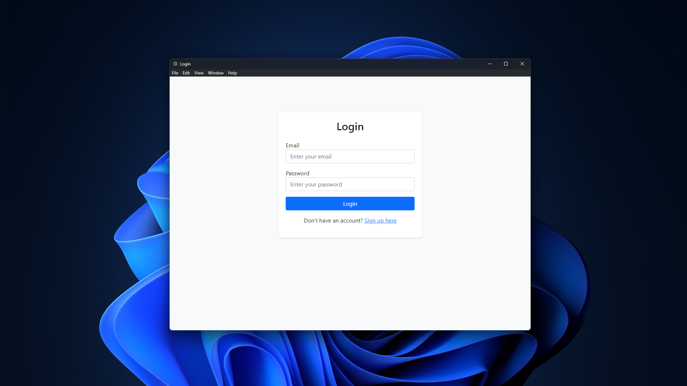
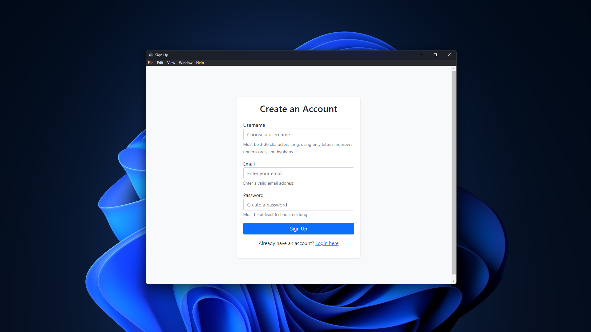
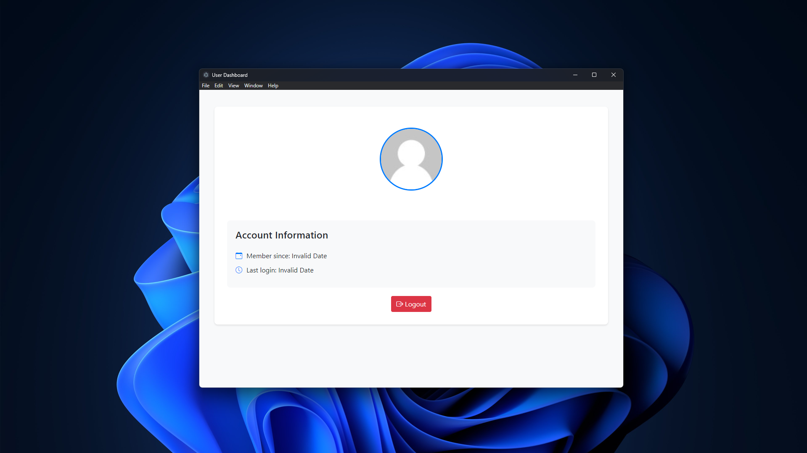

# My Electron App 🚀

> A modern desktop application built with Electron, Express.js, and MongoDB

[](https://github.com/Anikrp)
[](LICENSE)

## 🌟 Overview
This project is a robust desktop application built using Electron, Express.js, and MongoDB. It provides seamless user authentication features, including login and signup functionality, along with a dynamic dashboard for users to manage their profile information.

## 📸 Preview
<div align="center">
  <h3>Login Screen</h3>
  
  
  <h3>Sign Up Interface</h3>
  
  
  <h3>User Dashboard</h3>
  
</div>

## ✨ Features
- 🔐 Secure user authentication (login/signup)
- 👤 Interactive dashboard with profile picture
- 🔄 Robust session handling and authentication
- 🎯 Modern and intuitive user interface

## 🗂️ Project Structure
```
my-electron-app
├── src
│   ├── backend
│   │   ├── controllers
│   │   │   └── authController.js
│   │   ├── models
│   │   │   └── userModel.js
│   │   ├── routes
│   │   │   └── authRoutes.js
│   │   └── server.js
│   ├── frontend
│   │   ├── css
│   │   │   └── bootstrap.min.css
│   │   ├── js
│   │   │   └── main.js
│   │   ├── views
│   │   │   ├── dashboard.html
│   │   │   ├── login.html
│   │   │   └── signup.html
│   │   └── index.html
│   ├── main.js
│   └── preload.js
├── package.json
├── webpack.config.js
├── .env
└── README.md
```

## 🚀 Getting Started

### Prerequisites
- Electron Js
- Node.js (v14 or higher)
- MongoDB
- Git

### Installation
1. Clone the repository:
   ```bash
   git clone <repository-url>
   cd my-electron-app
   ```
2. Install dependencies:
   ```bash
   npm install
   ```

## 🔧 Usage
1. Start the backend server:
   ```bash
   npm run start:backend
   ```
2. Launch the Electron application:
   ```bash
   npm run start:electron
   ```

## ⚙️ Environment Variables
Create a `.env` file in the root directory and configure the following variables:
```env
MONGO_URI=<your_mongodb_connection_string>
SESSION_SECRET=<your_session_secret>
```


## 📝 License
This project is licensed under the MIT License. See the [LICENSE](LICENSE) file for details.

## 👨‍💻 Author
**Anik Roy**
- Created on: January 20, 2025
- Contact: [GitHub Profile](https://github.com/Anikrp)

---
Made with ❤️ by Anik Roy